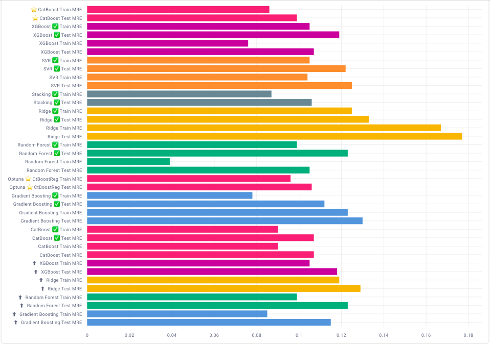

# 
WHAT CASE DO WE DECIDE?  
 
   
# Astana Real Estate Price Estimation Chatbot

## Introduction

Welcome to my Notebook for Real Estate Price Estimation in Astana!

In this notebook, I present a comprehensive approach to estimating real estate prices in Astana, Kazakhstan. Leveraging the power of Python and various libraries, I have developed a robust system that utilizes data from multiple sources to provide accurate price predictions.

Throughout the implementation, I incorporated the following key components:

* Data Acquisition from krisha.kz:
I gathered extensive real estate data from krisha.kz, one of the leading platforms for property listings in Kazakhstan. This data serves as the foundation for my price estimation model, encompassing a wide range of properties across Astana.

* Geocoding with 2GIS:
Utilizing geocoding services provided by 2GIS, I accurately pinpoint the geographical locations of properties within Astana. This crucial step enables me to incorporate spatial information into my analysis, enhancing the precision of my price estimations.

* Distance Calculation using Geopy:
By employing the Geopy library, I calculate distances between properties and various amenities, landmarks, and essential facilities in Astana. This feature adds value to my price estimations by considering proximity to key locations, which significantly influences property values.

* Information Retrieval from kn.kz:
Extracting pertinent details about residential complexes from kn.kz, I enrich my dataset with additional insights into neighborhood characteristics, amenities, and community features. This information contributes to a more comprehensive understanding of the factors affecting property prices in Astana.

By synergizing these tools and data sources, my notebook offers a sophisticated solution for estimating real estate prices in Astana. Through detailed code demonstrations and insightful analysis, I aim to provide valuable insights to stakeholders in the Astana housing market.

## Accessing the Deployed Project

This app is available at [https://astana-estate-prediction.up.railway.app](https://astana-estate-prediction.up.railway.app)      

    
    

# 
Let's look at the data. 
 
    
<table > 

   <tr>
    <th>Column</th>
    <th>Description</th>
    <th>Type</th>
  </tr>
  
   <tr>
    <td>price</td>
    <td>the total cost of the apartment</td>
    <td>int64</td>
  </tr>

   <tr>
    <td>owner</td>
    <td>ad from a realtor or from the property owner</td>
    <td>object</td>
  </tr>

   <tr>
    <td>complex_name</td>
    <td>name of residential complexes</td>
    <td>object</td>
  </tr>

   <tr>
    <td>house_type</td>
    <td>describes the materials used in the construction of the house</td>
    <td>object</td>
  </tr> 
    
  <tr>
    <td>in_pledge</td>
    <td>a boolean feature indicating whether the apartment is pledged or not</td>
    <td>bool</td>
  </tr>
    
  <tr>
    <td>construction_year</td>
    <td>the year of construction of the house</td>
    <td>int64</td>
  </tr>
    
   <tr>
    <td>ceiling_height</td>
    <td>the ceiling height in the apartment</td>
    <td>float64</td>
  </tr>

   <tr>
    <td>bathroom_info</td>
    <td>number of bathrooms in the apartment</td>
    <td>object</td>
  </tr>
    
   <tr>
    <td>condition</td>
    <td>the type of finishing in the apartment</td>
    <td>object</td>
  </tr> 
   
   <tr>
    <td>area</td>
    <td>the area of the apartment</td>
    <td>float64</td>
  </tr>  
    
   <tr>
    <td>room_count</td>
    <td>the number of rooms in the apartment</td>
    <td>int64</td>
  </tr>  
    
   <tr>
    <td>floor</td>
    <td>the floor on which the apartment is located</td>
    <td>int64</td>
  </tr> 
    
   <tr>
    <td>floor_count</td>
    <td>the number of floors in the building</td>
    <td>int64</td>
  </tr> 
    
  <tr>
    <td>district</td>
    <td>the name of the district where the building is located</td>
    <td>object</td>
  </tr> 

   <tr>
    <td>complex_class</td>
    <td>the housing class</td>
    <td>object</td>
  </tr> 
    
   <tr>
    <td>parking</td>
    <td>information about the presence and type of parking</td>
    <td>object</td>
  </tr> 
    
   <tr>
    <td>elevator</td>
    <td>information about the presence of an elevator in the building</td>
    <td>object</td>
  </tr> 
    
   <tr>
    <td>schools_within_500m</td>
    <td>the number of schools within a radius of 500 meters</td>
    <td>float64</td>
  </tr> 
    
   <tr>
    <td>kindergartens_within_500m</td>
    <td>the number of kindergartens within a radius of 500 meters</td>
    <td>ifloat64</td>
  </tr> 
    
   <tr>
    <td>park_within_1km</td>
    <td>the presence of a park within a kilometer radius</td>
    <td>bool</td>
  </tr> 
    
   <tr>
    <td>coordinates</td>
    <td>the coordinates of the residential building (latitude, longitude)</td>
    <td>object</td>
  </tr> 
    
   <tr>
    <td>distance_to_center</td>
    <td>the distance to the city center in kilometers</td>
    <td>float64</td>
  </tr> 
    
   <tr>
    <td>distance_to_botanical_garden</td>
    <td>the distance to the botanical park in kilometers</td>
    <td>float64</td>
  </tr> 
 
   <tr>
    <td>distance_to_triathlon_park</td>
    <td>the distance to the triathlonl park in kilometers</td>
    <td>float64</td>
  </tr>
  <tr>
    <td>distance_to_astana_park</td>
    <td>the distance to the central astana park in kilometers</td>
    <td>float64</td>
  </tr>
  <tr>
    <td>distance_to_treatment_facility</td>
    <td>the distance to the waste treatment facility in kilometers</td>
    <td>float64</td>
  </tr>
  <tr>
    <td>distance_to_railway_station_1</td>
    <td>the distance to the first railway station on the right bank in kilometers</td>
    <td>float64</td>
  </tr>
  <tr>
    <td>distance_to_railway_station_2</td>
    <td>the distance to the second railway station on the left bank in kilometers</td>
    <td>float64</td>
  </tr>
  <tr>
    <td>distance_to_industrial_zone</td>
    <td>the distance to the industrial zone in kilometers</td>
    <td>float64</td>
  </tr>
  <tr>
    <td>last_floor</td>
    <td>a boolean feature indicating whether the floor is the last one or not</td>
    <td>bool</td>
  </tr>
  <tr>
    <td>first_floor</td>
    <td>a boolean feature indicating whether the floor is the first one or not</td>
    <td>bool</td>
  </tr>

</table>

# 
Stages of the project. 
 

1. Data Parsing

At this stage, work was done on data scraping from two websites: "krisha.kz" and "kn.kz". The first website contains data on apartments for sale in the city of Astana, while the second one provides information about residential complexes in Astana.

2. Raw Data Processing

At this stage, significant work was done on processing the downloaded data. Relevant information was extracted into separate features. The names of the complexes were standardized in both tables, as they will serve as keys for merging the two tables in the future.

3. Handling Missing Values and Feature Engineering

At this stage, missing data was filled using three methods:

- Imputation from the second table by merging the datasets.
- Manual imputation by analyzing the conditions of buildings in Astana.
- Utilizing Random Forest Classifier.

Additionally, coordinates of residential complexes and addresses mentioned in the apartments' listings were obtained using the 2GIS API. This allowed for the generation of numerous useful additional features such as distance to the city center, parks, number of schools within a radius, and much more.

4. Exploratory analysis

Outliers were removed by analyzing the data and visualizations. For example, knowing the distance to the city center, apartments located outside Astana were removed. Additionally, the target variable was logarithmically transformed since the price distribution was far from normal.

5. Encoding and data preparation for training

Using various methods such as LabelEncoder, OrdinalEncoder, BinaryEncoder, and One-hot encoding, all categorical features were encoded depending on their characteristics.

6. Feature and Model Selection

At this stage, training was conducted on different types of models such as:

- Ridge: Ridge Regression
- SVR: Support Vector Regression
- Random Forest: Random Forest Regression
- Gradient Boosting: Gradient Boosting Regression
- XGBoost: Extreme Gradient Boosting Regression
- CatBoostRegression: CatBoost Regression

Hyperparameter tuning and feature selection were performed, resulting in an improvement in the metric, with Mean Relative Error (MRE) chosen as the evaluation metric.

Additionally, stacking method was experimented with, along with training on the full dataset using CatBoost.

The chosen model has been serialized.

7. Model deployment

- The serialized model has undergone rigorous testing to ensure its reliability and accuracy.
- A web application has been developed to provide a user-friendly interface for accessing the model's predictions.
- An index has been implemented to serve as the landing page for the website, providing users with easy navigation and access to relevant information.
- A periodic function has been written to automate the process of downloading new data and retraining the model on an annual basis, ensuring that it remains up-to-date and continues to deliver optimal performance over time.

 

# 
Conclusion. 
 

The best metrics were demonstrated by CatBoostRegression, which was trained on the complete dataset without removing features "condition" and "bathroom_info", and all names of residential complexes were passed as well, as CatBoost can handle a large number of unique categories and explicitly specified missing data, allowing these two features not to be removed. 

Interestingly, the base hyperparameters performed better than after tuning. Therefore, CatBoostRegression with default settings was chosen for serialization.

The baseline model has an error rate of 17%, whereas the selected model reduces this error to 10%, representing an improvement of 7 percentage points compared to the baseline model.